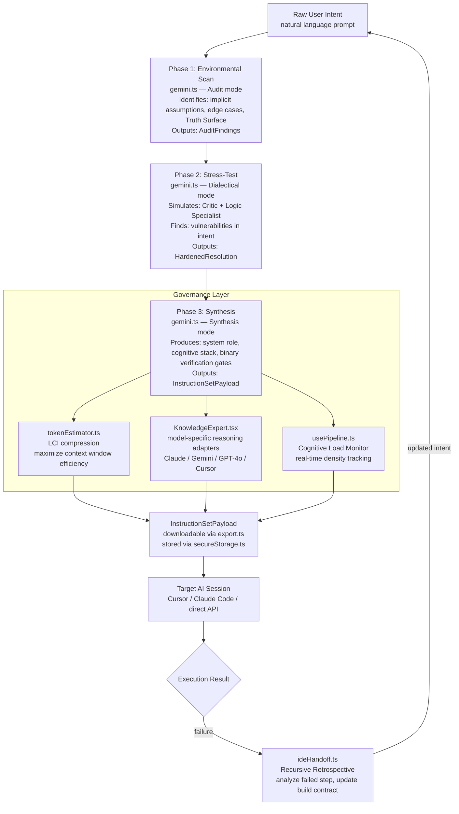
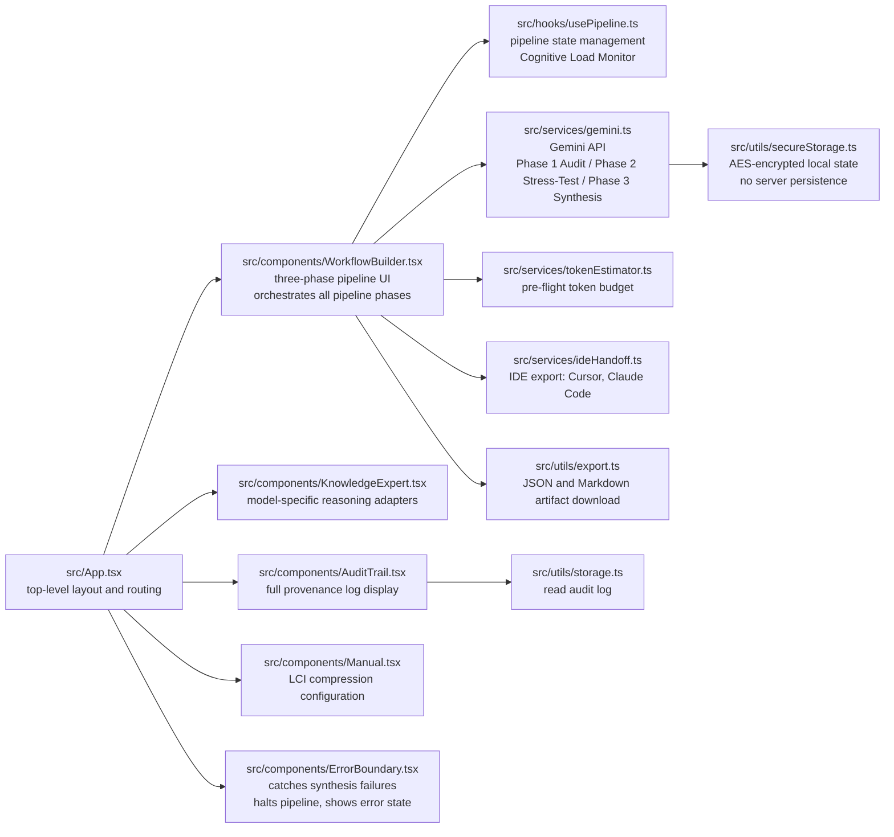

# Meta-Prompt Architect

**A three-phase prompt governance pipeline that turns natural language intent into structured, auditable, AI-ready instruction sets.**

Live app: https://ai.studio/apps/34d58bd0-0f42-4058-b4ab-265711ccde10

---

## What It Does

Meta-Prompt Architect is a prompt compiler. You give it a raw natural language intent. It runs that intent through three pipeline phases — environmental audit, adversarial stress-test, and structured synthesis — and returns a production-ready instruction set with full provenance, compressed context, and verified binary completion gates.

Every output is traceable. Every transformation is logged in `AuditTrail.tsx`. Nothing leaves the system without a complete chain of custody from raw input to synthesized payload.

---

## Three-Phase Pipeline

The pipeline runs in sequence. Phase 1 must complete before Phase 2 begins. Phase 2 must complete before Phase 3 begins. Each phase writes to the audit trail. If any phase fails, `ErrorBoundary.tsx` catches the failure and the pipeline halts at that phase — it does not produce partial output silently.



**Reading this diagram without sight:** Raw user intent enters Phase 1, the Environmental Scan, where gemini.ts in Audit mode identifies implicit assumptions, edge cases, and the Truth Surface — external data the prompt requires. Phase 1 outputs AuditFindings. Phase 2, the Stress-Test, runs gemini.ts in Dialectical mode, simulating a Critic and Logic Specialist to find vulnerabilities in the intent. Phase 2 outputs HardenedResolution. Phase 3, Synthesis, runs gemini.ts in Synthesis mode to produce a system role, cognitive stack, and binary verification gates as an InstructionSetPayload. Three Governance Layer components run in parallel during Phase 3: tokenEstimator.ts runs LCI compression to maximize context window efficiency; KnowledgeExpert.tsx applies model-specific reasoning adapters for Claude, Gemini, GPT-4o, and Cursor; and usePipeline.ts monitors cognitive load density. All three feed into the final InstructionSetPayload, which is downloadable via export.ts and persisted via secureStorage.ts. The payload is sent to a Target AI Session. If execution fails, ideHandoff.ts runs a Recursive Retrospective, analyzes the failed step, and feeds an updated intent back to Phase 1.

---

## Component Architecture

The application is a single-page React app. `App.tsx` owns layout and mounts five components. All AI calls go through `gemini.ts`. State persistence is encrypted locally via `secureStorage.ts` — nothing is sent to a server.



**Reading this diagram without sight:** src/App.tsx is the top-level component. It mounts five components: WorkflowBuilder.tsx, which orchestrates all three pipeline phases; KnowledgeExpert.tsx, which applies model-specific reasoning adapters; AuditTrail.tsx, which displays the full provenance log; Manual.tsx, which configures LCI compression; and ErrorBoundary.tsx, which catches synthesis failures and halts the pipeline. WorkflowBuilder.tsx uses three dependencies: usePipeline.ts for pipeline state management and Cognitive Load Monitoring; gemini.ts for all three AI phases (Audit, Stress-Test, Synthesis); and tokenEstimator.ts for pre-flight token budget estimation. AuditTrail.tsx reads from storage.ts. gemini.ts writes pipeline state to secureStorage.ts using AES encryption — no data leaves the browser to a server. WorkflowBuilder.tsx also connects to ideHandoff.ts for IDE export to Cursor and Claude Code, and to export.ts for JSON and Markdown artifact downloads.

---

## Key Features

- **Linear Context Injection (LCI)** — token compression to maximize context window efficiency (`tokenEstimator.ts`)
- **Cognitive Load Monitor** — real-time density tracking via `usePipeline.ts` to prevent prompts from exceeding model reasoning capacity
- **Model-Specific Adapters** — tailored reasoning logic for Claude, Gemini, GPT-4o, and IDE assistants (`KnowledgeExpert.tsx`)
- **Recursive Error-Correction** — `ideHandoff.ts` analyzes failed AI steps and updates the build contract
- **PII Shield** — integrated scanner in Phase 1 to prevent sensitive data from entering the pipeline
- **Encrypted Local Storage** — `secureStorage.ts` + `crypto.ts` — AES-256 encrypted, browser-only, no server

---

## Run Locally

**Prerequisites:** Node.js, Gemini API key

```
npm install
```

Set `GEMINI_API_KEY` in `.env.local`:

```
GEMINI_API_KEY=your_key_here
```

```
npm run dev
```

Open http://localhost:5173. Enter a prompt. The three-phase pipeline runs automatically.

---

## Tech Stack

- **Frontend:** React 18, TypeScript, Tailwind CSS
- **AI Engine:** Google Gemini via `src/services/gemini.ts`
- **Build:** Vite
- **Deployment:** Cloud Run / AI Studio

---

## V&T

**EXISTS:** Three-phase pipeline, LCI compression, Cognitive Load Monitor, model adapters, AuditTrail, ErrorBoundary, encrypted local storage, IDE handoff, PII scanner in Phase 1
**VERIFIED AGAINST:** src/ component tree, services/, hooks/, utils/ — all named above are present files
**NOT CLAIMED:** Validated prompt improvement metrics, benchmarked compression ratios, formal PII detection accuracy
**STATUS:** Prototype — functional pipeline, not production-hardened
